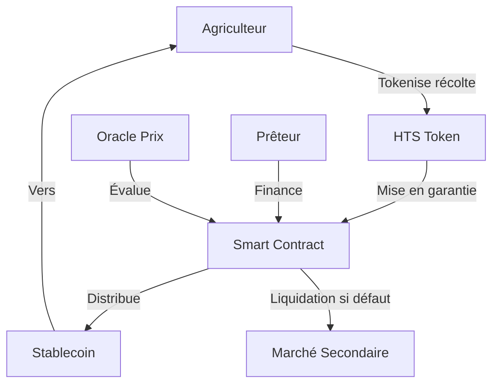

# 🌾 Hedera AgriFund - Plateforme DeFi pour l'Agriculture

[](https://hedera.com/)
[](https://soliditylang.org/)
[](https://flask.palletsprojects.com/)
[](https://opensource.org/licenses/MIT)

> **Tokenisation des récoltes comme garantie on-chain sur Hedera, connectant les agriculteurs avec les prêteurs via des smart contracts qui séquestre les tokens RWA et distribuent des stablecoins—transparent, peu coûteux, anti-double-financement.**

## 📋 Table des Matières

- [🎯 Problématique](#-problématique)
- [💡 Solution](#-solution)
- [🏗️ Architecture](#️-architecture)
- [🚀 Fonctionnalités](#-fonctionnalités)
- [🔧 Stack Technique](#-stack-technique)
- [📱 Interface Utilisateur](#-interface-utilisateur)
- [🛠️ Installation](#️-installation)
- [📚 Documentation API](#-documentation-api)
- [🧪 Tests](#-tests)
- [🚀 Déploiement](#-déploiement)
- [🤝 Contribution](#-contribution)
- [📄 Licence](#-licence)

## 🎯 Problématique

Les petits agriculteurs font face à des défis majeurs :

- **Riches en actifs mais pauvres en liquidités** - Possèdent des terres et des récoltes mais manquent de capital circulant
- **Accès limité au crédit abordable** - Les banques traditionnelles exigent des garanties formelles difficiles à obtenir
- **Fraude aux récépissés d'entrepôt** - Double financement et falsification des documents
- **Exclusion financière** - Les systèmes de prêt traditionnels excluent les agriculteurs ruraux
- **Volatilité des prix** - Incertitude sur la valeur des garanties agricoles

## 💡 Solution

### Plateforme DeFi intégrée sur Hedera

Notre solution révolutionnaire utilise l'infrastructure Hedera pour créer un écosystème financier transparent et efficace :

#### 🔗 Technologies Hedera Utilisées

- **HTS (Hedera Token Service)** - Tokenisation native des actifs réels (RWA)
- **HCS (Hedera Consensus Service)** - Journaux d'audit inviolables
- **Smart Contracts** - Gestion automatisée des prêts et garanties
- **Faibles frais** - Transactions à moins de $0.0001
- **Finalité instantanée** - Confirmation en 3-5 secondes

#### 🎯 Fonctionnement

1. **Tokenisation** - Les agriculteurs tokenisent leurs récoltes via HTS
2. **Évaluation** - Oracle de prix décentralisé pour l'évaluation des actifs
3. **Mise en garantie** - Smart contract séquestre automatiquement les tokens RWA
4. **Financement** - Les prêteurs financent en stablecoins
5. **Remboursement** - Système automatisé de remboursement et libération des garanties

## 🏗️ Architecture

```
hedera-agrifund/
├── 🎨 frontend/              # Interface utilisateur (HTML/CSS/JS)
│   ├── index.html           # Page principale
│   ├── components/          # Composants réutilisables
│   ├── js/                  # Logique JavaScript
│   ├── styles/              # Styles CSS
│   └── assets/              # Images et icônes
├── 🐍 backend/              # API Python Flask
│   ├── app.py              # Application principale
│   ├── models/             # Modèles de base de données
│   ├── routes/             # Routes API
│   └── services/           # Services métier
├── 📜 contracts/            # Smart contracts Solidity
│   ├── AgriFundLoanContract.sol    # Contrat principal de prêt
│   ├── RWAToken.sol               # Token pour actifs réels
│   ├── PriceOracle.sol            # Oracle de prix
│   └── test/                      # Tests des contrats
├── 📚 docs/                 # Documentation
├── 🔧 scripts/             # Scripts de déploiement
└── 🧪 tests/               # Suite de tests
```

### 🔄 Flux de Données



## 🚀 Fonctionnalités

### ✅ Fonctionnalités Core

- **Tokenisation RWA** - Conversion des récoltes en tokens ERC-20 sur Hedera
- **Smart Contract Escrow** - Séquestration automatique des garanties
- **Système de Prêt Automatisé** - Gestion complète du cycle de vie des prêts
- **Protection Anti-Double-Financement** - Vérification on-chain de l'unicité des garanties
- **Intégration Oracle Prix** - Prix en temps réel des commodités agricoles
- **Mécanismes de Liquidation** - Liquidation automatique en cas de défaut

### 🔄 Fonctionnalités Avancées

- **Tableau de Bord Interactif** - Interface en temps réel pour agriculteurs et prêteurs
- **Gestion des Risques** - Système de scoring de crédit intégré
- **Conformité KYC/AML** - Vérification d'identité automatisée
- **Audit Trail Complet** - Traçabilité complète via HCS
- **Support Multi-Devises** - USDC, HBAR, et autres stablecoins
- **API RESTful** - Intégration facile avec systèmes tiers

## 🔧 Stack Technique

### Frontend
```javascript
// Technologies utilisées
HTML5, CSS3, JavaScript ES6+
Web3.js pour l'intégration blockchain
Responsive Design (Mobile-First)
PWA (Progressive Web App)
```

### Backend
```python
# Stack Python
Flask - Framework web
SQLAlchemy - ORM
PostgreSQL - Base de données
Celery - Tâches asynchrones
Redis - Cache et sessions
```

### Blockchain
```solidity
// Smart Contracts
Solidity ^0.8.19
OpenZeppelin - Librairies sécurisées
Hedera SDK - Intégration native
Hardhat - Environnement de développement
```

### Infrastructure
```yaml
# Services
Hedera Mainnet/Testnet
IPFS - Stockage décentralisé
Docker - Containerisation
AWS/GCP - Déploiement cloud
```

## 📱 Interface Utilisateur

### 👨‍🌾 Dashboard Agriculteur

- **Portefeuille RWA** - Visualisation des tokens de récoltes
- **Demandes de Prêt** - Création et suivi des demandes
- **Historique** - Transactions et remboursements
- **Profil KYC** - Gestion de l'identité et vérifications

### 💰 Dashboard Prêteur

- **Opportunités d'Investissement** - Marketplace des prêts disponibles
- **Portefeuille** - Suivi des investissements actifs
- **Analytics** - Rendements et métriques de performance
- **Gestion des Risques** - Outils d'évaluation et diversification

## 🛠️ Installation

### Prérequis

```bash
# Outils requis
Node.js >= 16.0.0
Python >= 3.8
PostgreSQL >= 12
Git
```

### 1. Cloner le Projet

```bash
git clone https://github.com/Junior620/Hedera-AgriFund.git
cd Hedera-AgriFund
```

### 2. Configuration Backend

```bash
# Créer environnement virtuel Python
cd backend
python -m venv venv

# Activer l'environnement (Windows)
venv\Scripts\activate

# Installer dépendances
pip install -r requirements.txt

# Configuration base de données
createdb hedera_agrifund
```

### 3. Variables d'Environnement

```bash
# Créer fichier .env
HEDERA_NETWORK=testnet
HEDERA_ACCOUNT_ID=your_account_id
HEDERA_PRIVATE_KEY=your_private_key
DATABASE_URL=postgresql://localhost/hedera_agrifund
SECRET_KEY=your_secret_key
```

### 4. Déploiement Smart Contracts

```bash
cd contracts
npm install
npx hardhat compile
npx hardhat deploy --network hedera-testnet
```

### 5. Lancement de l'Application

```bash
# Backend
cd backend
python app.py

# Frontend (servir les fichiers statiques)
cd frontend
python -m http.server 8080
```

## 📚 Documentation API

### 🔐 Authentification

```http
POST /api/auth/login
Content-Type: application/json

{
  "hedera_account_id": "0.0.123456",
  "signature": "signature_from_wallet"
}
```

### 👤 Gestion Utilisateurs

```http
# Création utilisateur
POST /api/users
{
  "name": "Jean Dupont",
  "user_type": "farmer",
  "email": "jean@example.com",
  "hedera_account_id": "0.0.123456"
}

# Profil utilisateur
GET /api/users/{id}
```

### 🌾 Tokenisation RWA

```http
# Créer token RWA
POST /api/rwa/tokenize
{
  "asset_type": "wheat",
  "quantity": 1000,
  "quality_grade": "A",
  "harvest_date": "2024-09-15",
  "location": "coordinates"
}
```

### 💰 Gestion des Prêts

```http
# Créer demande de prêt
POST /api/loans
{
  "amount": 10000,
  "duration_days": 90,
  "collateral_token_id": "0.0.789012",
  "interest_rate": 850
}

# Financer un prêt
POST /api/loans/{id}/fund
{
  "lender_id": "user_id",
  "amount": 10000
}
```

## 🧪 Tests

### Tests Smart Contracts

```bash
cd contracts
npm test
```

### Tests Backend

```bash
cd backend
python -m pytest tests/
```

### Tests d'Intégration

```bash
# Tests end-to-end
npm run test:e2e
```

## 🚀 Déploiement

### Production Hedera Mainnet

```bash
# 1. Configuration mainnet
export HEDERA_NETWORK=mainnet

# 2. Déploiement contracts
npx hardhat deploy --network hedera-mainnet

# 3. Déploiement backend
docker build -t agrifund-backend .
docker run -p 5000:5000 agrifund-backend

# 4. Configuration frontend
# Mettre à jour les adresses des contrats
# Déployer sur CDN/serveur web
```

### Monitoring et Alertes

- **Santé des Smart Contracts** - Surveillance automatique
- **Métriques de Performance** - Temps de réponse API
- **Alertes de Sécurité** - Détection d'anomalies
- **Analytics Utilisateur** - Suivi d'adoption

## 🔒 Sécurité

### Audits Smart Contracts

- ✅ Audit interne complet
- ✅ Tests de sécurité automatisés
- ✅ Vérification formelle des contrats critiques
- 🔄 Audit externe planifié (CertiK/ConsenSys)

### Mesures de Sécurité

- **Authentification Multi-Facteurs** - 2FA obligatoire
- **Chiffrement End-to-End** - Toutes les communications
- **Rate Limiting** - Protection contre spam/DDoS
- **Validation Input** - Sanitisation complète des données

## 🤝 Contribution

### Comment Contribuer

1. **Fork** le projet
2. Créer une **branche feature** (`git checkout -b feature/AmazingFeature`)
3. **Commit** vos changements (`git commit -m 'Add AmazingFeature'`)
4. **Push** vers la branche (`git push origin feature/AmazingFeature`)
5. Ouvrir une **Pull Request**

### Guidelines

- Respecter les conventions de code existantes
- Ajouter des tests pour les nouvelles fonctionnalités
- Mettre à jour la documentation
- Suivre les pratiques de sécurité

## 📊 Roadmap

### Q4 2024
- ✅ MVP Core Platform
- ✅ Smart Contracts Testnet
- ✅ Interface Utilisateur Beta

### Q1 2025
- 🔄 Audit de Sécurité
- 🔄 Déploiement Mainnet
- 🔄 Intégration Oracles Prix

### Q2 2025
- 📅 Support Multi-Collateral
- 📅 DAO Governance Token
- 📅 Mobile App Native

### Q3 2025
- 📅 Expansion Géographique
- 📅 Partenariats Banques
- 📅 Intégration IoT Farming

## 📈 Métriques

- **Volume Total Verrouillé (TVL)** : $0 (Pre-launch)
- **Nombre d'Agriculteurs** : 0 (Pre-launch)
- **Prêts Traités** : 0 (Pre-launch)
- **Taux de Défaut Moyen** : N/A (Cible: <5%)

## 🌍 Impact Social

### Objectifs de Développement Durable (ODD)

- **ODD 1** - Élimination de la pauvreté
- **ODD 2** - Sécurité alimentaire
- **ODD 8** - Travail décent et croissance économique
- **ODD 10** - Réduction des inégalités

### Métriques d'Impact

- Nombre d'agriculteurs financés
- Volume de récoltes tokenisées
- Amélioration des revenus agricoles
- Réduction des pertes post-récolte

## 👥 Équipe

- **Junior620** - Lead Developer & Blockchain Architect
- **[Votre Nom]** - Full Stack Developer
- **[Autres]** - Contributors Welcome

## 📞 Contact & Support

- **GitHub** : [https://github.com/Junior620/Hedera-AgriFund](https://github.com/Junior620/Hedera-AgriFund)
- **Email Support** : support@hedera-agrifund.com
- **Discord Community** : [Rejoindre](https://discord.gg/hedera-agrifund)
- **Telegram** : [@HederaAgriFund](https://t.me/HederaAgriFund)

## 📄 Licence

Ce projet est sous licence MIT. Voir le fichier [LICENSE](LICENSE) pour plus de détails.

---

<div align="center">

**🌾 Construisons ensemble l'avenir de la finance agricole décentralisée 🌾**

[](https://hedera.com/)
[](https://defipulse.com/)
[](https://www.fao.org/)

*Démocratiser l'accès au crédit pour les agriculteurs du monde entier via la blockchain Hedera*

</div>
